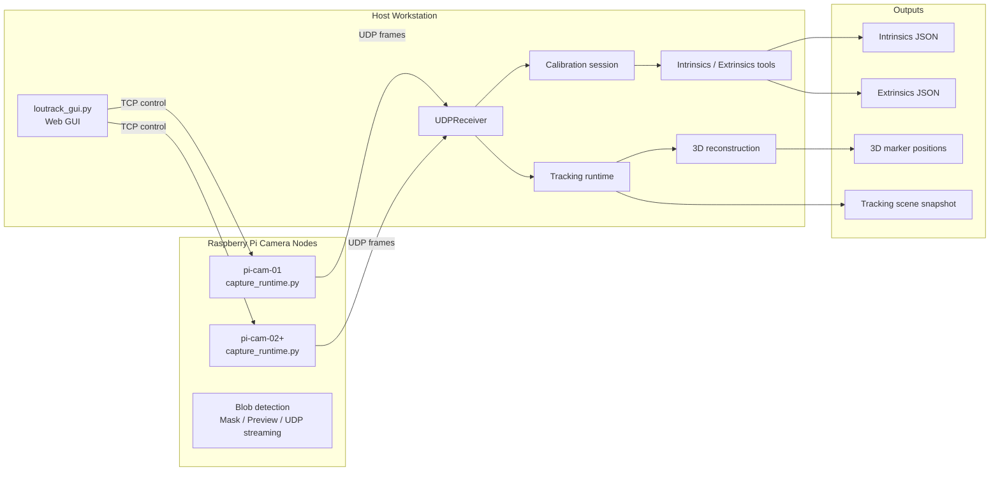

# Loutrack2

Loutrack2 is an open-source optical motion tracking project built around Raspberry Pi camera nodes, host-side calibration tools, and a GUI-based workflow.

日本語はこっち→: [README_ja.md](README_ja.md)

## Overview

Loutrack2 combines:

- Raspberry Pi camera capture nodes
- host-side control and calibration
- multi-camera 3D reconstruction
- a GUI workflow for setup, tuning, capture, and inspection

The repository is intended as a practical base for building and evaluating a custom camera-based tracking system. The current implementation is most mature in capture, calibration, and 3D reconstruction.

## System Overview

## Current Status

Loutrack2 currently provides a working multi-camera optical tracking foundation.

Available now:

Current scope:

- useful for building and validating a custom multi-camera tracking setup
- not yet a finished full-body tracking or IK output system

## Roadmap

The project direction after the current baseline includes:

- more robust clustering and identity tracking for multiple rigid bodies
- body-part level tracking for head, chest, waist, and feet
- more stable rigid-body association through the full pipeline
- IK-friendly pose output
- SteamVR tracker output
- further improvements to setup, deployment, and hardware documentation
- intrinsics calibration status reporting that keeps host-side calibration progress visible in the GUI

## GUI Workflow

The GUI already covers a connected workflow from camera bring-up to tracking inspection.

Typical flow:

1. Start the Pi capture nodes
2. Open the host GUI
3. Adjust blob detection
4. Build masks
5. Capture pose data
6. Capture floor or metric data
7. Generate extrinsics
8. Inspect tracking and scene snapshots

The tracking page uses the bundled three.js viewer with both `three.module.min.js` and its split `three.core.min.js` dependency. Its initial loading state does not claim a canvas context before WebGL starts, and the retired 2D canvas fallback has been replaced by a clear WebGL-unavailable message if the renderer cannot start.
When live tracking starts, the GUI temporarily pauses its passive UDP discovery receiver so the tracking pipeline can bind the same UDP port without an address-in-use failure, then resumes discovery after tracking stops or startup fails.
Tracking start, stop, and error feedback is also mirrored into the Tracking Control status line so failures are visible without leaving the 3D Tracking page.
Tracking Control exposes the live epipolar gate as a `1.0` to `6.0px` slider in `0.5px` steps, with the current runtime default set to `3.5px`.
Host rigid-body fitting now enforces `max_rms_error_m=0.055` by default, so pose hypotheses with larger rigid-fit residuals are rejected before being counted as valid tracking poses.
Camera preview tiles now distinguish between preview intentionally being off for the current view, a healthy live host-proxied MJPEG stream, and upstream-unreachable proxy failures. Client-side MJPEG disconnects are treated as normal preview lifecycle events rather than Pi upstream reachability failures.
New calibration settings default to blob threshold `150` and mask threshold `120`.
The current Raspberry Pi Camera Module 3 Wide NoIR capture baseline is `1536x864 @ 118fps`. The 118fps fixed runtime leaves a small frame-duration margin below the sensor's 120fps mode so PTP-based scheduled start and software phase diagnostics can apply bounded timing corrections without requesting a faster-than-120fps frame period.
Pi runtime diagnostics include `camera_controls`, which reports the requested and last accepted `FrameDurationLimits` plus Picamera2 control success/error counters so frame-rate trimming can be verified from ping/status logs.
Tracking status and logs now expose a lightweight performance spine for later optimization: Pi runtime summaries report queue age, blob detection, JSON encode, UDP send, payload bytes, and send errors; Host status reports pair age, cleanup/eviction counts, triangulation, rigid estimation, metrics, logger enqueue, and writer lag; the GUI stream includes scene/SSE timestamps plus browser-side SSE, parse, apply, rAF, and WebGL render summaries.

## Hardware Direction

Loutrack2 also includes a hardware direction centered around DIY tracking camera nodes and tracked targets.

Current hardware direction:

- Raspberry Pi-based camera nodes built from commonly available parts
- Raspberry Pi Camera Module 3 Wide NoIR as the current camera configuration
- a PoE HAT so the node can be powered and networked over a single LAN cable
- a custom board mounted above the Pi that combines camera holding and IR LED illumination
- open hardware files in the repository, including PCB design data and 3D-printable parts
- reflective tracked markers built from 3D-printed spheres and retroreflective tape

What this enables:

- active IR illumination from the device side
- camera capture through an IR-pass configuration for higher-SNR reflective blob detection
- ceiling or room installation with simplified wiring through PoE
- a hardware stack that can be reproduced with DIY fabrication and off-the-shelf components

Relevant repository areas:

- [`hardware`](hardware) for printable parts and board-related assets
- [`hardware/LED board`](hardware/LED%20board) for the custom LED board design files
- [`hardware/pi mount`](hardware/pi%20mount) for Pi mount printable parts

The longer-term goal is a tracking platform that can be assembled, modified, and extended by the community.

## Open Source

Loutrack2 is being developed in the open.

- pull requests are welcome
- forks and experiments are welcome
- documentation, setup improvements, hardware refinements, and calibration workflow improvements are particularly useful

## License

This project is intended to be released under `GPL-3.0-or-later`.

## Repository Map

- [`src/pi`](src/pi) for Raspberry Pi capture services
- [`src/deploy`](src/deploy) for Raspberry Pi code deployment, service installation, and rollback helpers
- [`src/host`](src/host) for the host GUI, receiver, runtime, and tracking pipeline
- [`src/camera-calibration`](src/camera-calibration) for intrinsics and extrinsics tooling
- [`src/calibration`](src/calibration) for calibration domain types and targets
- [`calibration`](calibration) for generated calibration artifacts
- [`docs/30_procedure`](docs/30_procedure) for Pi / GUI startup, verification, and shutdown procedures
- [`schema`](schema) for message and control contracts
- [`tests`](tests) for regression coverage
