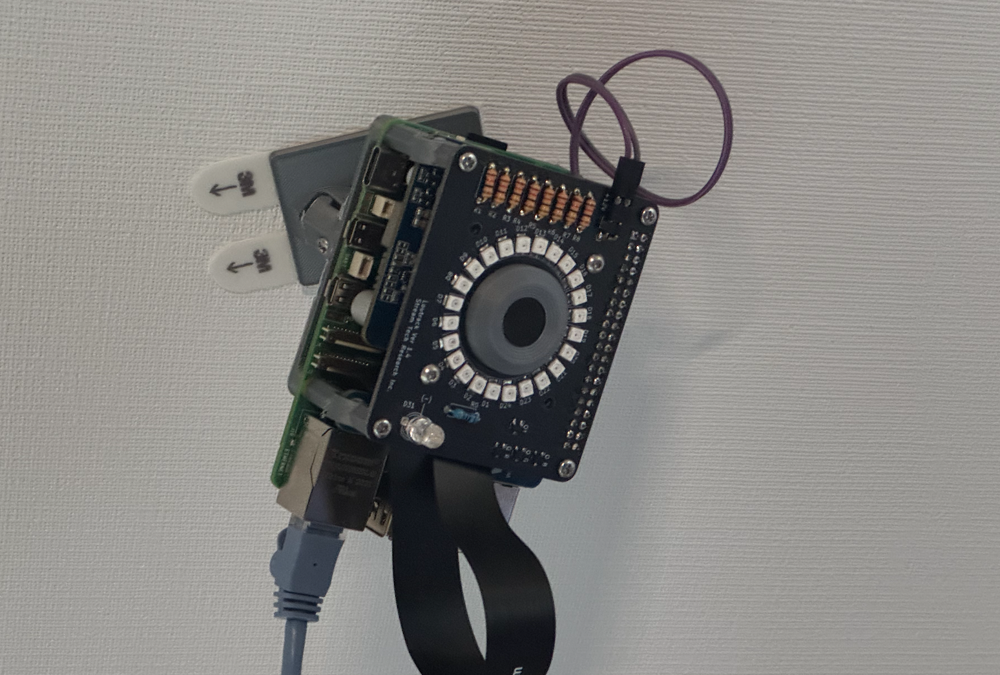
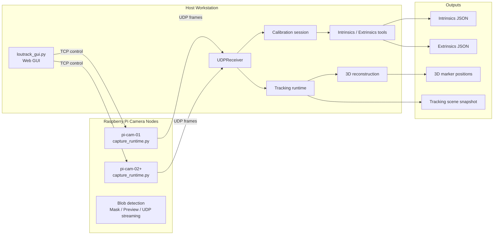
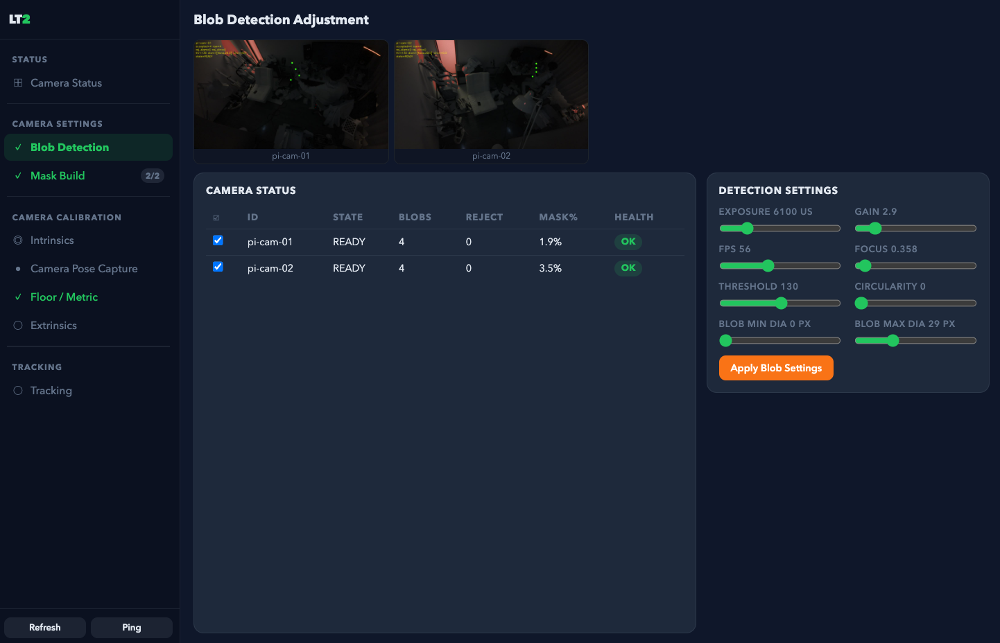
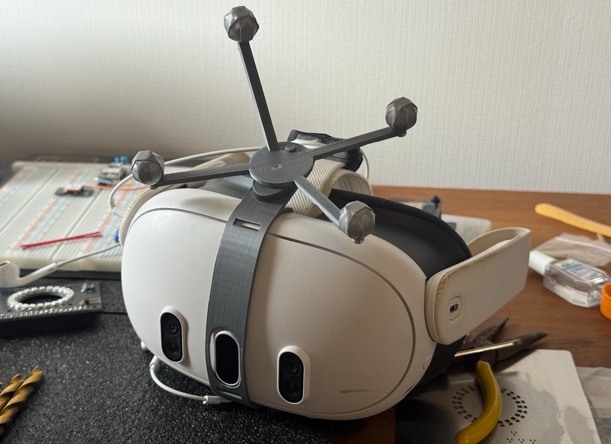

# Loutrack2

Loutrack2 is an open-source optical motion tracking project built around Raspberry Pi camera nodes, host-side calibration tools, and a GUI-based workflow.

日本語はこっち→: [README_ja.md](README_ja.md)

## Overview

Loutrack2 combines:

- Raspberry Pi camera capture nodes
- host-side control and calibration
- multi-camera 3D reconstruction
- a GUI workflow for setup, tuning, capture, and inspection

The repository is intended as a practical base for building and evaluating a custom camera-based tracking system. The current implementation is most mature in capture, calibration, and 3D reconstruction.

## System Overview

## Current Status

Loutrack2 currently provides a working multi-camera optical tracking foundation.

Available now:

- Raspberry Pi capture nodes can detect reflective blobs and stream observations to the host
- the host GUI can drive blob tuning, mask building, pose capture, floor or metric capture, and extrinsics generation
- the host GUI now keeps selected-camera targeting strict for camera commands and settings application
- runtime-generated capture paths are surfaced as latest observed values and can be adopted explicitly without silently overwriting draft form inputs
- stopped intrinsics captures can now be synced back from the Pi for host-side calibration without relying on stale in-memory frame state
- the tracking GUI queues SSE scene updates for the next browser animation frame, drawing raw points without interpolation while surfacing geometry and WebGL timing diagnostics
- the intrinsics result panel now refreshes immediately when entering the view or launching host-side calibration, reducing stale "Calibrating on host..." displays
- the Matplotlib extrinsics viewer can now overlay triangulated wand metric samples in similarity, metric, or world space
- wand-based world alignment now chooses the floor-normal sign so ceiling cameras appear at positive height above the floor plane
- wand-based world alignment now constrains floor-normal direction from the wand face: +X is elbow to long branch, +Y is elbow to short branch, and the selected front/back side defines +Z
- the GUI 3D Tracking viewer now uses the floor/metric capture wand as the world origin when metric/world extrinsics are available, with a black Z-up viewport, Z-axis orbit controls, camera-name labels, and visible triangulated-blob points separate from rigid bodies
- tracking start now configures selected Pis for low-overhead preview and explicitly starts their `pose_capture` UDP streams before expecting 3D blob points
- tracking start tolerates Pis that are already streaming so the host receiver can recover cleanly after a GUI restart or partial start failure
- live tracking pairing now consumes each buffered Pi frame only once, emits pairs in chronological order, and calculates FPS/latency from UDP receive timestamps, preventing inflated 300+ FPS and missing-frame counts from stale or out-of-order buffer reprocessing
- live tracking uses a 10 ms timestamp-only pairing window, matching the nearest capture-time frames at 56 fps without re-enabling `frame_index` fallback
- live tracking scene updates now use a push stream for the GUI viewer, emit newly completed frame pairs without a fixed 16 ms batching delay, and draw world-space trails and marker positions without double-applying rigid-body transforms
- tracking UDP diagnostics now keep Pi-side capture timestamps separate from raw host receive time; `pose_capture` payloads omit `frame_index`, and tracking pairing uses timestamp-only matching while surfacing timestamp source and capture-to-send timing
- tracking performance diagnostics now separate Pi queue/detection/send timing, Host pair/3D/rigid/logger timing, SSE write health, and browser receive/apply/render timing with bounded rolling summaries and low-frequency JSONL diagnostic events
- raw 3D blob reconstruction now uses one-to-one epipolar assignment before triangulation, preventing the same 2D blob from generating multiple 3D points while keeping rigid-body geometry out of the raw matcher
- rigid-body candidate clustering now uses an 80 mm radius instead of marker-diameter spacing, with a single-pattern fallback that tests the full point set only when clustering produces no large-enough candidate
- Pi control commands are now defined from a shared runtime manifest so the Pi server, host CLI, ping diagnostics, and `schema/control.json` stay aligned as intrinsics commands evolve
- the host GUI backend now routes settings, tracking, intrinsics, capture-log, and extrinsics orchestration through dedicated internal services while keeping the existing `/api/*` surface unchanged
- the next GUI backend split now also has extracted camera-status, workflow-summary, and `/api/state` presentation helpers staged as compatibility-preserving host modules
- the Pi blob-detection to host tracking-viewer path now skips preview packet work when no preview consumer is active, throttles idle diagnostics, reuses paired-frame buffers incrementally, and updates the Three.js viewer without recreating hot-path geometry attributes on every scene event
- Pi-side tracking now avoids static-mask frame copies in blob detection, skips diameter/circularity math unless those filters are active, and only builds MJPEG preview packets while a viewer is actually connected
- tracking runtime status for the GUI is now sampled/cached separately from fast scene updates, and camera scene geometry is reused instead of being rebuilt on every pose callback
- the calibration flow can produce intrinsics and extrinsics JSON outputs
- synchronized multi-camera observations can be reconstructed into 3D marker positions
- the host can inspect tracking state, scene snapshots, and calibration-related metrics

Current scope:

- useful for building and validating a custom multi-camera tracking setup
- not yet a finished full-body tracking or IK output system

## Roadmap

The project direction after the current baseline includes:

- more robust clustering and identity tracking for multiple rigid bodies
- body-part level tracking for head, chest, waist, and feet
- more stable rigid-body association through the full pipeline
- IK-friendly pose output
- SteamVR tracker output
- further improvements to setup, deployment, and hardware documentation
- intrinsics calibration status reporting that keeps host-side calibration progress visible in the GUI

## GUI Workflow

The GUI already covers a connected workflow from camera bring-up to tracking inspection.

Typical flow:

1. Start the Pi capture nodes
2. Open the host GUI
3. Adjust blob detection
4. Build masks
5. Capture pose data
6. Capture floor or metric data
7. Generate extrinsics
8. Inspect tracking and scene snapshots

The tracking page uses the bundled three.js viewer with both `three.module.min.js` and its split `three.core.min.js` dependency. Its initial loading state does not claim a canvas context before WebGL starts, and the retired 2D canvas fallback has been replaced by a clear WebGL-unavailable message if the renderer cannot start.
When live tracking starts, the GUI temporarily pauses its passive UDP discovery receiver so the tracking pipeline can bind the same UDP port without an address-in-use failure, then resumes discovery after tracking stops or startup fails.
Tracking start, stop, and error feedback is also mirrored into the Tracking Control status line so failures are visible without leaving the 3D Tracking page.
Tracking status and logs now expose a lightweight performance spine for later optimization: Pi runtime summaries report queue age, blob detection, JSON encode, UDP send, payload bytes, and send errors; Host status reports pair age, cleanup/eviction counts, triangulation, rigid estimation, metrics, logger enqueue, and writer lag; the GUI stream includes scene/SSE timestamps plus browser-side SSE, parse, apply, rAF, and WebGL render summaries.

## Hardware Direction

Loutrack2 also includes a hardware direction centered around DIY tracking camera nodes and tracked targets.

Current hardware direction:

- Raspberry Pi-based camera nodes built from commonly available parts
- Raspberry Pi Camera Module 3 Wide NoIR as the current camera configuration
- a PoE HAT so the node can be powered and networked over a single LAN cable
- a custom board mounted above the Pi that combines camera holding and IR LED illumination
- open hardware files in the repository, including PCB design data and 3D-printable parts
- reflective tracked markers built from 3D-printed spheres and retroreflective tape

What this enables:

- active IR illumination from the device side
- camera capture through an IR-pass configuration for higher-SNR reflective blob detection
- ceiling or room installation with simplified wiring through PoE
- a hardware stack that can be reproduced with DIY fabrication and off-the-shelf components

Relevant repository areas:

- [`hardware`](hardware) for printable parts and board-related assets
- [`hardware/LED board`](hardware/LED%20board) for the custom LED board design files
- [`hardware/pi mount`](hardware/pi%20mount) for Pi mount printable parts

The longer-term goal is a tracking platform that can be assembled, modified, and extended by the community.

## Open Source

Loutrack2 is being developed in the open.

- pull requests are welcome
- forks and experiments are welcome
- documentation, setup improvements, hardware refinements, and calibration workflow improvements are particularly useful

## License

This project is intended to be released under `GPL-3.0-or-later`.

## Repository Map

- [`src/pi`](src/pi) for Raspberry Pi capture services
- [`src/host`](src/host) for the host GUI, receiver, runtime, and tracking pipeline
- [`src/camera-calibration`](src/camera-calibration) for intrinsics and extrinsics tooling
- [`src/calibration`](src/calibration) for calibration domain types and targets
- [`calibration`](calibration) for generated calibration artifacts
- [`schema`](schema) for message and control contracts
- [`tests`](tests) for regression coverage
