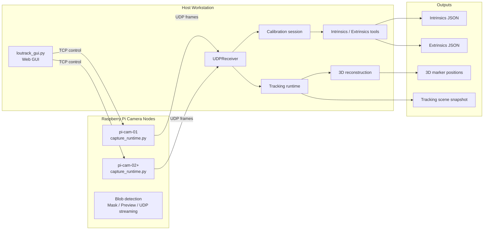

# Loutrack2

Loutrack2 is an open-source optical motion tracking stack built around Raspberry Pi camera nodes, host-side calibration tools, and a GUI workflow that is already practical for multi-camera bring-up and tracking experiments.

日本語はこちら: [README_ja.md](README_ja.md)

## What It Is

Loutrack2 combines:

- Raspberry Pi camera capture nodes for reflective marker observation
- host-side control, calibration, and inspection tools
- multi-camera 3D reconstruction and tracking
- a GUI-first workflow for setup, tuning, capture, and review

This repository is aimed at people who want to build, understand, and extend a DIY camera-based tracking system in the open. The current project is strongest in camera bring-up, calibration, and live tracking inspection.

## What Works Today

- Pi capture nodes detect reflective blobs and stream observations to the host
- the host GUI covers blob tuning, mask building, pose capture, floor or metric capture, and extrinsics generation
- intrinsics and extrinsics outputs are generated as JSON artifacts
- synchronized camera observations are reconstructed into 3D marker positions
- the 3D Tracking page shows scene state, camera health, stream diagnostics, and live rigid-body status
- custom rigid bodies can be registered or removed directly from triangulated blobs in the tracking viewer

## System Overview

## Workflow

The current Loutrack2 experience is centered on a single GUI flow from camera startup to live tracking review.

Typical flow:

1. Start the Pi capture nodes
2. Open the host GUI
3. Tune blob detection
4. Build masks
5. Capture pose data
6. Capture floor or metric data
7. Generate extrinsics
8. Start tracking and inspect the reconstructed scene

The startup and shutdown procedure for Pi nodes and the GUI lives at [`docs/30_procedure/pi_gui_start_stop.md`](docs/30_procedure/pi_gui_start_stop.md).

## Tracking View

The 3D Tracking page is one of the clearest expressions of the project's current direction: operational feedback is visible, rigid bodies can be inspected live, and the scene is meant to be understandable while the system is running.

Current highlights:

- live tracking start and stop feedback is surfaced in the GUI
- camera health, latency, and stream diagnostics stay visible beside the scene
- the epipolar gate is adjustable from Tracking Control
- custom rigid-body registration works directly from triangulated blobs

## Hardware Direction

Loutrack2 also includes an open hardware direction centered around reproducible DIY tracking camera nodes and tracked targets.

Current hardware direction:

- Raspberry Pi-based camera nodes built from commonly available parts
- Raspberry Pi Camera Module 3 Wide NoIR as the current camera baseline
- PoE HAT-based power and networking over a single LAN cable
- a custom board mounted above the Pi that combines camera holding and IR LED illumination
- open hardware files in the repository, including PCB design data and 3D-printable parts
- reflective tracked markers built from 3D-printed spheres and retroreflective tape

Relevant repository areas:

- [`hardware`](hardware) for printable parts and board-related assets
- [`hardware/LED board`](hardware/LED%20board) for the custom LED board design files
- [`hardware/pi mount`](hardware/pi%20mount) for Pi mount printable parts

## Project Direction

Loutrack2 is already useful as a multi-camera optical tracking foundation, but it is still a builder-oriented platform rather than a finished end-user full-body tracker.

The next direction includes:

- more stable rigid-body clustering and identity tracking
- body-part level tracking for head, chest, waist, and feet
- more reliable rigid-body association through the full pipeline
- IK-friendly pose output
- SteamVR tracker output
- continued improvements to deployment, setup, and hardware documentation

## Open Source

Loutrack2 is being developed in the open.

- pull requests are welcome
- forks and experiments are welcome
- documentation, setup improvements, hardware refinements, and calibration workflow improvements are especially useful

## License

This project is intended to be released under `GPL-3.0-or-later`.

## Repository Map

- [`src/pi`](src/pi) for Raspberry Pi capture services
- [`src/deploy`](src/deploy) for Raspberry Pi code deployment, service installation, and rollback helpers
- [`src/host`](src/host) for the host GUI, receiver, runtime, and tracking pipeline
- [`src/camera-calibration`](src/camera-calibration) for intrinsics and extrinsics tooling
- [`src/calibration`](src/calibration) for calibration domain types and targets
- [`calibration`](calibration) for generated calibration artifacts
- [`docs/30_procedure`](docs/30_procedure) for Pi / GUI startup, verification, and shutdown procedures
- [`schema`](schema) for message and control contracts
- [`tests`](tests) for regression coverage
