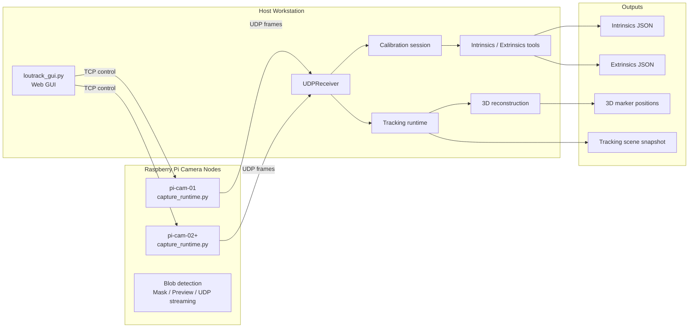
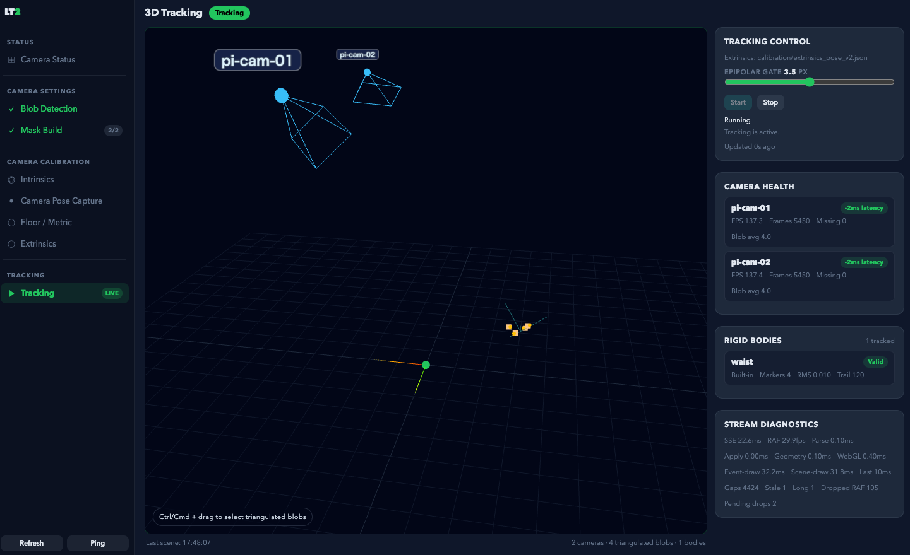

# Loutrack2

Loutrack2 は、Raspberry Pi カメラノード、Host 側の較正ツール、そして GUI 中心の運用フローで構成された、オープンソースの光学式モーショントラッキング基盤です。いまの時点でも、複数カメラの立ち上げ、較正、追跡確認にかなり実用的なところまで来ています。

English README: [README.md](README.md)

## これは何か

Loutrack2 は、次の要素をひとつの流れとして扱えるプロジェクトです。

- 反射マーカー観測のための Raspberry Pi カメラキャプチャノード
- Host 側の制御、較正、確認ツール
- 複数カメラ観測にもとづく 3D 復元と追跡
- セットアップから調整、収録、確認までをつなぐ GUI ワークフロー

既製品のブラックボックスに寄せるのではなく、DIY の追跡システムを自分たちで作り、理解し、拡張していくための土台として公開しています。現状は、とくにカメラ立ち上げ、較正、ライブ追跡確認の流れが強いです。

## いま実際にできること

- Pi ノードで反射マーカーの blob を検出し、Host に観測結果を送る
- Host GUI から blob 調整、mask 作成、pose capture、floor or metric capture、extrinsics 生成まで進められる
- intrinsics と extrinsics の成果物を JSON として生成できる
- 同期した複数カメラ観測から 3D marker position を復元できる
- 3D Tracking ページで scene 状態、camera health、stream diagnostics、rigid-body 状態を確認できる
- triangulated blobs から custom rigid body をその場で登録、削除できる

## 全体像

## ワークフロー

いまの Loutrack2 は、カメラ起動からライブ追跡確認までをひとつの GUI フローで扱えるのが大きな魅力です。

典型的な流れ:

1. 各 Pi の capture node を起動する
2. Host GUI を開く
3. Blob Detection を調整する
4. Mask を作成する
5. Pose Capture を行う
6. Floor / Metric を収録する
7. Extrinsics を生成する
8. Tracking を開始して復元シーンを確認する

Pi と GUI の起動、確認、停止の手順は [`docs/30_procedure/pi_gui_start_stop.md`](docs/30_procedure/pi_gui_start_stop.md) にあります。

## 3D Tracking の現在地

3D Tracking ページは、いまの Loutrack2 の雰囲気をかなりよく表しています。動いている最中の scene を見ながら、状態を把握し、rigid body を調整できる設計になっています。

現在の見どころ:

- tracking の start / stop 状態が GUI 上で分かりやすく見える
- camera health、latency、stream diagnostics を scene の横で追える
- Tracking Control から epipolar gate を調整できる
- triangulated blobs から custom rigid body をその場で登録できる

## ハードウェアの方向性

Loutrack2 はソフトウェアだけでなく、再現しやすい DIY トラッキングハードウェアも含むプロジェクトです。

現在のハードウェア方向:

- Raspberry Pi ベースのカメラノードで構成
- 現在のカメラ基準は Raspberry Pi Camera Module 3 Wide NoIR
- PoE HAT により LAN ケーブル 1 本で電源とネットワークをまとめやすい
- Pi 上部に、カメラ保持機構と IR LED 照射を兼ねる自作基板を載せる構成
- PCB 設計データや 3D プリント部品をリポジトリに含む
- 3D プリント球と再帰反射テープを組み合わせたマーカーを使う想定

関連ディレクトリ:

- [`hardware`](hardware): ハードウェア関連ファイル
- [`hardware/LED board`](hardware/LED%20board): LED 照射基板の設計データ
- [`hardware/pi mount`](hardware/pi%20mount): Pi マウント用の 3D プリント部品

## プロジェクトの向かう先

Loutrack2 はすでに複数カメラ光学トラッキングの基盤として役立ちますが、まだ完成済みのエンドユーザー向けフルボディトラッカーではありません。いまは、作る人が触って育てるためのプラットフォームです。

次の方向性:

- より安定した rigid-body clustering と identity tracking
- head、chest、waist、feet などの body-part tracking
- パイプライン全体を通した rigid-body association の安定化
- IK に載せやすい pose 出力
- SteamVR tracker output
- デプロイ、セットアップ、ハードウェア文書の継続的な改善

## Open Source とコントリビュート

Loutrack2 はオープンに育てていくプロジェクトです。

- pull request を歓迎します
- fork や個人実験を歓迎します
- ドキュメント改善、セットアップ改善、ハードウェア改善、較正フロー改善を特に歓迎します

## ライセンス

このプロジェクトは `GPL-3.0-or-later` で公開する想定です。

## リポジトリ構成

- [`src/pi`](src/pi): Raspberry Pi 側キャプチャサービス
- [`src/deploy`](src/deploy): Raspberry Pi 配備、サービス導入、ロールバック補助
- [`src/host`](src/host): Host 側 GUI、受信、runtime、tracking pipeline
- [`src/camera-calibration`](src/camera-calibration): intrinsics / extrinsics ツール
- [`src/calibration`](src/calibration): 較正ドメイン型と target 定義
- [`calibration`](calibration): 生成された較正成果物
- [`docs/30_procedure`](docs/30_procedure): Pi / GUI の起動、確認、停止手順
- [`schema`](schema): 制御とメッセージの契約
- [`tests`](tests): 回帰テスト
