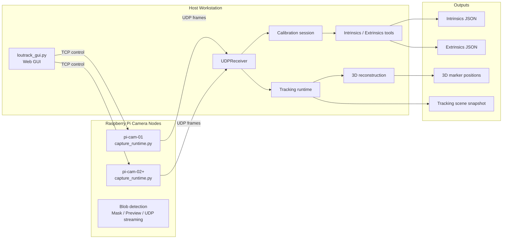

# Loutrack2

Raspberry Pi カメラノードをベースにした、オープンソースの光学式モーショントラッキングプロジェクトです。

Loutrack2 は、複数カメラのトラッキングデバイスを自作し、Host 側で較正し、将来的にはフルボディトラッキングまで発展させていくためのコミュニティ志向プロジェクトです。

## Loutrack2 とは

Loutrack2 は、次の要素で構成される光学式トラッキングシステムです。

- Raspberry Pi ベースのカメラキャプチャノード
- Host 側の制御、較正、可視化
- 複数カメラ観測にもとづく 3D 復元
- セットアップから確認までをつなぐ GUI ワークフロー

このプロジェクトは、DIY モーショントラッキングをより理解しやすく、再現しやすく、拡張しやすくすることを目標に、オープンに開発されています。

## このプロジェクトの魅力

- クローズドな既製品に依存せず、自分たちで追跡ハードウェアを作れる
- 複数カメラを Host 側からまとめて扱える
- ばらばらのスクリプトではなく、GUI ベースで較正と確認を進められる
- すでに使える追跡基盤として試しながら、将来のボディトラッキング機能にも参加できる

## 全体像

## 現在の到達点

Loutrack2 は、すでに複数カメラ光学トラッキングの土台として機能しています。

現在できること:

- Raspberry Pi ノードで反射マーカーの blob を検出し、Host に観測結果を送る
- Host GUI から blob 調整、mask 作成、pose capture、floor or metric capture、extrinsics 生成まで進められる
- intrinsics と extrinsics の較正成果物を JSON として生成できる
- 複数カメラ観測から 3D の marker position を復元できる
- tracking 状態、scene snapshot、較正まわりのメトリクスを可視化できる

いまの Loutrack2 は、複数カメラ環境を組み上げて検証するための基盤としてかなり実用的です。

一方で、完成したフルボディ IK トラッカーとしてはまだ発展途中です。

## ロードマップ

Loutrack2 は、より完成度の高いオープンソースのボディトラッキング基盤を目指しています。

今後の主な方向性:

- 複数剛体に対するより安定したクラスタリングと ID 維持
- head、chest、waist、feet などの body-part tracking
- 剛体の対応付けと追跡の安定化
- IK に載せやすい pose 出力
- SteamVR tracker output
- デプロイ、セットアップ、ハードウェア情報のさらなる整備

## GUI ワークフロー

現在の Loutrack2 で特に強い部分のひとつが GUI ベースの運用フローです。カメラ立ち上げから tracking 確認まで、一連の流れを 1 つの操作系で扱えます。

典型的な流れ:

1. 各 Pi で capture node を起動する
2. Host GUI を開く
3. Blob Detection を調整する
4. Mask を作成する
5. Pose Capture を行う
6. Floor / Metric を収録する
7. Extrinsics を生成する
8. Tracking と scene snapshot を確認する

## ハードウェアの方向性

Loutrack2 はソフトウェアだけのプロジェクトではなく、DIY のトラッキングハードウェアを含むプロジェクトでもあります。

現在のハードウェア構成の方向性:

- Raspberry Pi をベースにしたカメラノードで構成されています
- 現在のカメラ構成は Raspberry Pi Camera Module 3 Wide NoIR を前提にしています
- PoE HAT を使うことで、電源とネットワークを LAN ケーブル 1 本でまとめられます
- Pi の上には、カメラ保持機構と IR LED 照射を一体化した自作基板を載せる構成です
- リポジトリには基板データや 3D プリント用部品が含まれており、構成を追えるようになっています
- トラッキングポイントは、3D プリントした球体と再帰反射テープを組み合わせたマーカーを使う想定です

この構成でできること:

- デバイス側から赤外線を照射できる
- IR パス構成のカメラと組み合わせることで、反射マーカーの blob を高い SNR で検出しやすくなる
- PoE により、天井や部屋の高所に比較的配線しやすい
- DIY と入手しやすい部材をベースに、同じ方向性のノードを再現しやすい

関連ディレクトリ:

- [`hardware`](hardware): ハードウェア関連ファイル
- [`hardware/LED board`](hardware/LED%20board): LED 照射基板の設計データ
- [`hardware/pi mount`](hardware/pi%20mount): Pi マウント用の 3D プリント部品

将来的には、部屋や用途に合わせて自作、改良、フォークできる、実践的なコミュニティベースのトラッキングプラットフォームを目指しています。

## Open Source とコントリビュート

Loutrack2 はオープンに育てていくプロジェクトです。

- pull request を歓迎します
- fork や個人実験を歓迎します
- ドキュメント改善、セットアップ改善、ハードウェア改善、較正フロー改善を特に歓迎します

DIY ボディトラッキングをもっと作りやすく、運用しやすくしたい人と一緒に育てていけたらうれしいです。

## ライセンス

このプロジェクトは `GPL-3.0-or-later` で公開する想定です。

オープンソースとして fork や改良、再配布を歓迎しつつ、派生物も GPL 系の条件を引き継ぐことを前提にしています。

## リポジトリ構成

- [`src/pi`](src/pi): Raspberry Pi 側キャプチャサービス
- [`src/host`](src/host): Host 側 GUI、受信、runtime、tracking pipeline
- [`src/camera-calibration`](src/camera-calibration): intrinsics / extrinsics ツール
- [`src/calibration`](src/calibration): 較正ドメイン型と target 定義
- [`calibration`](calibration): 生成された較正成果物
- [`schema`](schema): 制御とメッセージの契約
- [`tests`](tests): 回帰テスト

## 現時点での位置づけ

現在の Loutrack2 は、次のように理解するのが近いです。

- 実際に動く複数カメラ追跡基盤
- GUI 中心の較正・確認ツールチェーン
- フルボディトラッキングに向かうオープンソース基盤

まだ完成済みのエンドユーザー向け VR トラッキング製品ではありません。
